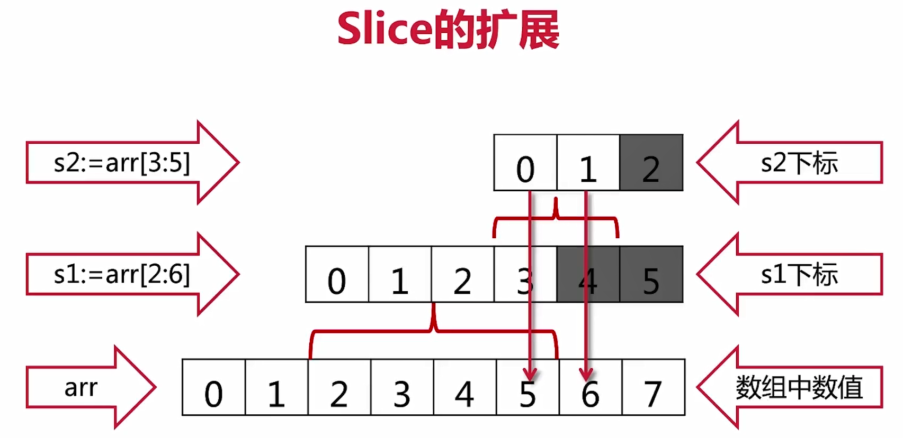
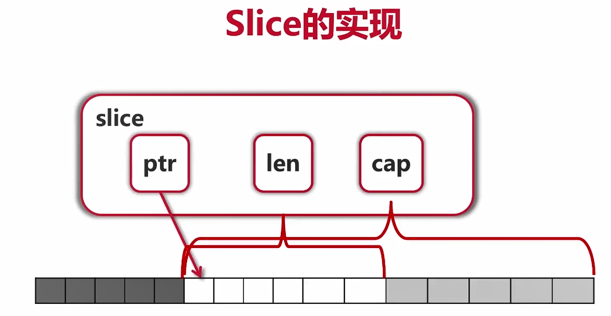

# GoLang核心编程

## 1 语言基础

### 1-1 变量

#### 变量定义

```go
var a int
var s string

var a, b int = 3, 4

var a, b, c, s = 3, 4, true, "def"

// 只能在函数内使用
a, b, c, s := 3, 4, true, "def"
b = 5

// 并非全局变量，而是包内变量
var (
	aa = 3
	ss = "kkk"
	bb = true
)
```

#### 内建变量类型

* bool, string
* (u)int, (u)int8, (u)int16, (u)int64, uintptr
* btye(8bits), rune(32bits) 没有char只有rune
* float32, float64, complex64, complex128

#### 强制类型转换

```golang
var c int = int(math.Sqrt(float64(a*a + b*b)))
```

#### 常量

const 数值可以作为各种类型使用

```go
const filename = "abc.txt"
const a, b = 3, 4
```

#### 枚举

```go
// 普通枚举类型
const (
    cpp    = 1
    java   = 2
    python = 3
    golang = 4
)
// 自增枚举类型
const (
    // iota表示自增
    cpp = iota
    java
    python
    golang
)
```

### 1-2 结构语句

#### if ··· else ···

```go
if err != nil {
    ...
} else {
    ...
}

// contents, err为if内局部变量
if contents, err := ioutil.ReadFile(filename); err != nil {
    ...
} else {
    ...
}
```

#### switch

case内自动break,除非fallthrough

### for

```go
// 初始条件,退出条件,循环语句
for ; n > 0; n /= 2 {
    ...
}
// 仅有循环语句
for scanner.Scan() {
    ...
}
// 死循环
for {
    ...
}
```

### function

没有默认参数、可选参数

函数的同类型参数可以一同定义,函数的返回值为复数时须严格遵守数量(可以为返回值取名)

```go
func div(a, b int) (q, r int) {
    return a / b, a % b
}
```

函数参数传递

```go
// 匿名函数参数传递 apply(op func(int, int) int, a, b int) int
apply(
    func(i1, i2 int) int {
        return int(math.Pow(float64(i1), float64(i2)))
    }, 3, 4,
)
```

可变参数列表

```go
func sum(numbers ...int) int {
    ...
}
```

### 1-3 指针

Go语言只有值传递,通过指针来实现引用传递

```go
// *a, *b 表示指向的值
func swap(a, b *int) {
    *b, *a = *a, *b
}
```

### 1-4 数据结构

#### 数组

```go
var arr1 [5]int
arr2 := [3]int{1, 2, 3}
arr3 := [...]int{2, 4, 6, 8, 10}

var grid [4][5]int
```

range遍历

```go
for _, v := range arr3 {
    fmt.Println(v)
}
```

数组是值类型

```go
// cannot use arr2 (variable of type [3]int) as [5]int
func printArr(arr [5]int) {
    ...
}

// 数组的参数引用
func printArrPointer(arr *[5]int) {
    // 数组遍历
    arr[0] = 100
    ...
}
```

### 1-5 切片

slice是原本array的一个视图(指针)



slice底层实现依赖ptr,len,cap. 其中cap决定了slice能往后扩展,而不能往前扩展



slice能够根据cap往后取,索引不能超过len取值

```go
fmt.Println("s2[4]=", s2[4])     // index out of range
fmt.Println("s2[4]=", s1[4:5])
```

#### append操作

```go
// 添加元素
s3 := append(s2, 10)
s4 := append(s3, 11)
s5 := append(s4, 12)
fmt.Println("s3, s4, s5 = ", s3, s4, s5)
// s4, s5添加的元素会覆盖原有arr元素值
// 超过arr的cap,系统则会分配新的更大cap的arr,把元素复制过去
// 后续会由垃圾回收机制处理
fmt.Println("arr = ", arr)

// output:
// slice of arr= [0 1 2 3 4 5 6 7]
// s3, s4, s5 =  [5 6 10] [5 6 10 11] [5 6 10 11 12]
// arr =  [0 1 2 3 4 5 6 10]
```

#### make创建

```go
s2 := make([]int, 16) // len = cap = 16
s3 := make([]int, 10, 32) // len = 10, cap = 32
```

#### copy

```go
copy(s2, s1) // s1拷给s2
```

#### delete

```go
// 把s2中0~2和4~end的slice加一起,来删除第3个元素
// s2[4:]...表示可变参数
s2 = append(s2[:3], s2[4:]...)

fmt.Println("Popping from front")
front := s2[0]
s2 = s2[1:]

fmt.Println("Popping from back")
tail := s2[len(s2)-1]
s2 = s2[:len(s2)-1]
```

### map

· map[k]v  map[k1]map[k2]v

map的key:

1. map使用哈希表,必须可以比较相等
2. 除了slice,map,function的内建类型都可以为key
3. Struct类型不包含上述字段,也可作为key

```go
// 创建
// hash map
m := map[string]string{
    "name":    "ccmouse",
    "course":  "golang",
    "site":    "imooc",
    "quality": "notbad",
}

m2 := make(map[string]int) // m2 == empty map

var m3 map[string]int // m3 == nil

fmt.Println("Traversing map")
for k, v := range m {
    fmt.Println(k, v)
}

fmt.Println("Getting values")
courseName := m["course"]

if causeName, ok := m["cause"]; ok {
    fmt.Println(causeName)
} 

fmt.Println("Deleting values")

delete(m, "name")
```

### rune类型(Strings操作)

rune相当于go的char

1. 使用range遍历pos,rune对
2. 使用utf8.RuneCountInString获得字符数量
3. 使用len获得字节长度
4. 使用[]byte获得字节

#### 其他字符串操作

1. Fileds, Split, Join
2. Contains, Index
3. ToLower, ToUpper
4. Trim, TrimRight, TrimLeft

## 2 面向对象

### 2-1 struct

Go语言仅支持封装,不支持继承和多态

```go
// 基础结构
type treeNode struct {
    val         int
    left, right *treeNode
}

var root treeNode

root = treeNode{val: 3}
root.left = &treeNode{}
root.right = &treeNode{5, nil, nil}
root.right.left = new(treeNode)

nodes := []treeNode{
    {val: 3},
    {},
    {6, nil, nil},
}
```

工厂函数createNode

```go
func createNode(val int) *treeNode {
    // 返回局部变量的地址, 是合法的
    return &treeNode{val: val}
}

root.right.left = createNode(2)
```

为结构体提供函数方法

```go
// 为treenode提供print函数
func (node treeNode) print() {
    fmt.Print(node.val)
}
root.print()

// 传入指针来进行引用传递
func (node *treeNode) setVal(val int) {
    node.val = val
}
root.setVal(4)
```

### 2-2 指针接收者与值接收者

* **要改变内容必须使用指针接收者**
* **结构过大也要考虑使用指针接收者**
* **一致性:如有指针接收者,最好都是指针接收者**

### 2-3 封装

* 名字一般使用CamelCase
* 首字母大写:public
* 首字母小写:private
